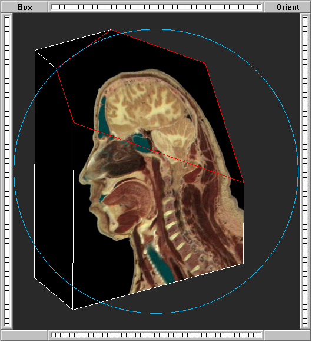

# Voxvu #

_Voxvu_ is a program for interactive visualization of 3D voxel data on Microsoft Windows.
It has no dependencies other than the Microsoft Visual Studio IDE and the Microsoft Foundation Classes
(MFC) library which comes with it.

Unlike most 3D graphics programs, _Voxvu_ does not use OpenGL or any other 3D graphics library.
Everything is coded from scratch in C++. The images you see are computed one pixel at a time with a
software renderer which does 3D texture mapping onto a polyhedron model. As a result:
1. There is no hardware acceleration; everything is done in software
2. The code is compact: full release build is under 97K bytes (using MFC as shared DLL)
2. Porting to other platforms (including resource-constrained systems) is simplified
3. The code may be useful as a teaching resource

# Getting started #
The source code is set up to compile with Microsoft Visual Studio 2010.  It should not be difficult to adapt it
for earlier or later releases of Visual Studio.

The Voxvu solution contains two projects: Voxvu itself, and a simple program which generates voxel data files for testing.
1. Build both projects
2. Run the test generator and create all three test data sets
   * note each data set consists of a pair of files, one for the voxel data and another for metadata
3. Run Voxvu and choose File->Open, then select the metadata file (not the .dat file) for one of the test data sets.
   * see Using the GUI below for how to interact with the image
4. To open your own voxel data set:
   * create a header-less binary file containing the data in slice, row, column order
   * choose File->New in Voxvu
   * select 8-bit gray, 16-bit gray, or 15-bit RGB data format
   * choose your voxel data file
   * enter the array dimensions (number of voxels in each row and column + number of slices)
   and the voxel dimensions (spacing between adjacent voxels in each direction in e.g. millimeters)
   * when you have the data on your screen, choose File->Save As to save a data-file/metadata-file pair under a new name
   * use File->Open and select the metadata file to re-open the data set in subsequent sessions

   
# Using the GUI #
Voxvu uses the old Windows "Multiple Document Interface" (MDI) style, which is somewhat outdated but served well
enough when the first version of this program was written in 1997. Each file opens in a separate child window
inside the main program window, and all windows are resizable by dragging the window edges/corners.

Inside each child window, you will see
* the voxel data, texture-mapped onto a convex polyhedron geometry model
* a blue circle, representing an _Arcball_ controller for rotating the model
* a blue horizontal line with a little rectangular box at one end
* four buttons in each of the four corners
* four "ribbon controls" along each of the four sides

## Rotating the model ##
The blue circle is the equator of a spherical, virtual trackball. Click inside the circle and drag to rotate the
polyhedron model in any direction. Click outside the circle to grab the "ball" by the nearest point on the equator
and drag to rotate in-plane, i.e. about an axis perpendicular to the screen. Click the button marked "Orient"
at any time, to reset the default orientation, where the first slice in the data is facing you.

## Digging in ##
To see deeper into the voxel data, double-click inside any of its polygonal surfaces (the outline will turn red),
then "push" the surface in by clicking in the ribbon control on the left side of the window and dragging upward.
Click and drag back downward to pull the surface out.

Once you have selected a surface, you can also use your mouse wheel instead of the left ribbon: roll away from
you to push in, toward you to pull out.

Click the button marked "Box" at any time, to reset the original bounding box.

## Viewing non-orthogonal slice planes ##
When you "push in" one of the model bounding planes, what actually happens is that the program creates another
bounding plane. The model you see is the (always convex) polyhedron defined by clipping the original 6-sided
box against any additional bounding planes you create.

The additional bounding planes don't have to be oriented perpendicular to the X, Y, Z sampling axes. After you
select a plane and push it in (go in about half-way when you try this first), hold down the CTRL key and click
on a point inside the plane, then drag the mouse to re-orient the plane to any angle.
* Double-clicking in the left ribbon control instantly moves the selected plane to the middle of the model.
* The point you click (remember to hold down CTRL) becomes the pivot point
* It's best to rotate the model so the plane you're going to push in and manipulate is tilted.  If you try
to work with a plane which is parallel to the screen, you may find it difficult to see what the program is doing.

## Zooming and Panning ##
The ribbon control at the top of the image window allows you to zoom the display in (click and drag to the right)
and out (click and drag to the left). Double-click anywhere in the top ribbon control to reset to the default
magnification.

Once you're zoomed in, use the right ribbon control to pan the display up/down, and the bottom ribbon control
to pan left/right.  Double-click either ribbon control to reset the pan position, i.e., to re-center the
display in the given direction.

## Adjusting Contrast (window/level) ##
When viewing grayscale data (either 8-bit or 16-bit), drag the little blue rectangle at the rightmost end of
the horizontal blue line to change the contrast. When you do, you'll see the blue rectangle is part of a big
crosshairs control, which allows you to adjust two different contrast parameters called _window_ and _level_.

Dragging the crosshairs left/right adjusts the _window_, which is the fraction of the total range of voxel
values which are mapped to the black-to-white grayscale range in the display. When pushed all the way to the right,
the window is maximized, providing minimum contrast but allowing you to distinguish more shades of gray in the data.

Dragging the crosshairs up/down adjusts the _level_, which is the voxel value mapped to the middle of the
grayscale range. When pushed all the way to the top, the level is minimized, resulting in high brightness and
possibly some clipping of brighter voxels to white. When pushed all the way to the bottom, the level is
maximized, resulting in a darker display and possibly some clipping of darker voxels to black.

Note window/level adjustments are not available when viewing 15-bit RGB voxel data, and so the crosshairs
control normally does not appear.

## Miscellaneous ##
Right-clicking anywhere in the image display pops up a "context menu" which allows you to show or hide the
Arcball circle and Window/Level crosshairs (they're still active when invisible, just not shown), or to choose
whether or not to turn on "two-pass rendering".

Two-pass rendering is a way to improve responsiveness on very slow computer hardware. The display resolution is
reduced while you are dragging the mouse, and bumped back up again when you let go.  This was a big deal in
the late 1990s, but isn't necessary on today's PCs.  Keeping the two-pass mechanisms in the code may prove
useful if you want to add more sophisticated (hence slower) rendering algorithms.

# To-Do List #
Here's a very short list of things I'd change, if I only had the time...
* Eliminate dependency on MFC
* Port to Linux/X11, Mac OS X, and other platforms
* Add option to render using OpenGL (which would instantly provide hardware acceleration)
* Add more sophisticated rendering algorithms such as MIP, synthetic radiograph, and surface rendering

# Acknowledgements and References #
The name _Voxvu_ is a tribute to an earlier program by that name, developed by Tim Van Hook and Ruth Johnson of
Trancept Systems, Inc. and Sun Microsystems, Inc., which was just one of a host of amazing graphics applications
which came with Trancept's TAAC-1 "application accelerator" board (see http://www.virhistory.com/trancept/trancept.html).
I learned an enormous amount from reading the excellent source code provided by Trancept/Sun.

E. Ruth Johnson and Charles E. Mosher, Jr.. 1989. Integration of volume rendering and geometric graphics: work in progress.
In Proceedings of the 1989 Chapel Hill workshop on Volume visualization (VVS '89). ACM, New York, NY, USA, 1-7.
DOI=10.1145/329129.329130
http://doi.acm.org/10.1145/329129.329130
(Thanks to Trancept founder Nick England for the reference.)

The _Arcball_ rotation controller was developed by Ken Shoemake. You can find his original paper at
https://www.talisman.org/~erlkonig/misc/shoemake92-arcball.pdf

The "ribbon" controls are a poor-man's version of the excellent "thumbwheel" controls provided in the original
Silicon Graphics Inc. IRIX Workstation GUI.  My good friend Betsy Zeller, who was at SGI back in the day, tells me
these were developed by Rob Myers, Delle Maxwell and Alain Dumesny. Nice work, guys.
